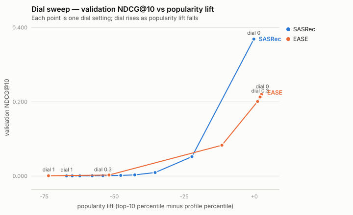

# Candidate head-to-head, dial sweep, and winner — issue #19

Generated 2026-08-15 19:35 UTC by `uv run compare`
([Ari-03/AniList_Rec#19](https://github.com/Ari-03/AniList_Rec/issues/19)).
Protocol: SPEC §5 — held-out users, temporal 80/20, full-catalogue ranking
through the serving pipeline (franchise filter on). Architectures compared on
**test** users dial-off; the dial swept on **validation** users for the
finalists. Per-candidate training detail: [ease.md](ease.md), [als.md](als.md),
[sasrec.md](sasrec.md), bars in [baseline_bar.md](baseline_bar.md).

## Head-to-head (test users, dial off)

| model | NDCG@10 [95% CI] | recall@10 | recall@50 | regret@10 | pop lift | pop lift (niche) | coverage@10 | users |
|---|---|---|---|---|---|---|---|---|
| MostPopular | 0.1983 [0.1947, 0.2021] | 0.124 | 0.291 | 0.0064 | +3.0 | +7.5 | 0.9% | 9971 |
| item-item BM25 | 0.1300 [0.1263, 0.1335] | 0.112 | 0.323 | 0.0045 | +0.7 | +2.9 | 6.3% | 9971 |
| EASE | 0.2247 [0.2208, 0.2286] | 0.139 | 0.332 | 0.0057 | +2.9 | +7.2 | 2.0% | 9971 |
| ALS | 0.0757 [0.0730, 0.0783] | 0.074 | 0.243 | 0.0018 | +0.5 | +2.0 | 12.1% | 9971 |
| SASRec | 0.3665 [0.3621, 0.3711] | 0.256 | 0.538 | 0.0223 | -0.1 | +2.4 | 12.9% | 9971 |

Two-sided bar (SPEC §4): beat item-item BM25 **0.1300** and
MostPopular **0.1983** on NDCG@10 with coverage@10 at least
2x MostPopular's 0.9%
(the Cremonesi degenerate-coverage guard).

- **EASE**: NDCG@10 0.2247 [0.2208, 0.2286], coverage@10 2.0% — **clears the two-sided bar**.
- **ALS**: NDCG@10 0.0757 [0.0730, 0.0783], coverage@10 12.1% — does not clear the bar.
- **SASRec**: NDCG@10 0.3665 [0.3621, 0.3711], coverage@10 12.9% — **clears the two-sided bar**.

## Winner: SASRec

The winner leads beyond CI noise.

## Dial sweep (validation users)

The dial is the SPEC §1 serve-time popularity re-rank, computed in **rank
space**: per-user score percentile minus `dial x` popularity percentile,
applied inside the same serving path the export container runs
([export contract](../docs/export-contract.md)). Rank space is what makes the
0-1 knob architecture-independent in practice: the first formulation divided
raw scores by `(popularity + 1)^dial`, and its useful range collapsed with the
winner's score scale (NDCG@10 fell 0.369 -> 0.173 by dial 0.1 on SASRec logits
while EASE barely moved before 0.6). Percentiles are scale-free, so the same
dial value trades the same amount of preference for popularity on every
candidate.

### SASRec

| dial | val NDCG@10 [95% CI] | recall@50 | pop lift | pop lift (niche) | coverage@10 |
|---|---|---|---|---|---|
| 0 | 0.3688 [0.3646, 0.3731] | 0.540 | -0.2 | +2.4 | 12.9% |
| 0.05 | 0.0520 [0.0499, 0.0543] | 0.401 | -22.2 | -27.3 | 24.9% |
| 0.1 | 0.0093 [0.0085, 0.0101] | 0.174 | -35.4 | -39.0 | 24.3% |
| 0.15 | 0.0029 [0.0025, 0.0033] | 0.066 | -42.7 | -45.0 | 21.8% |
| 0.2 | 0.0015 [0.0013, 0.0019] | 0.028 | -47.7 | -48.8 | 19.5% |
| 0.3 | 0.0008 [0.0006, 0.0010] | 0.008 | -54.1 | -53.6 | 15.8% |
| 0.4 | 0.0006 [0.0004, 0.0008] | 0.004 | -57.9 | -56.4 | 13.4% |
| 0.6 | 0.0004 [0.0003, 0.0006] | 0.001 | -62.3 | -59.9 | 10.6% |
| 0.8 | 0.0003 [0.0002, 0.0005] | 0.001 | -65.0 | -62.1 | 9.0% |
| 1 | 0.0002 [0.0001, 0.0003] | 0.001 | -67.0 | -63.8 | 8.1% |

### EASE

| dial | val NDCG@10 [95% CI] | recall@50 | pop lift | pop lift (niche) | coverage@10 |
|---|---|---|---|---|---|
| 0 | 0.2244 [0.2203, 0.2283] | 0.335 | +2.9 | +7.2 | 2.2% |
| 0.05 | 0.2241 [0.2201, 0.2280] | 0.336 | +2.9 | +7.1 | 2.7% |
| 0.1 | 0.2235 [0.2197, 0.2275] | 0.337 | +2.8 | +6.9 | 3.2% |
| 0.15 | 0.2218 [0.2181, 0.2259] | 0.338 | +2.7 | +6.7 | 4.0% |
| 0.2 | 0.2199 [0.2161, 0.2240] | 0.339 | +2.6 | +6.0 | 4.8% |
| 0.3 | 0.2128 [0.2088, 0.2170] | 0.337 | +2.1 | +4.6 | 7.1% |
| 0.4 | 0.2007 [0.1968, 0.2047] | 0.330 | +1.2 | +2.3 | 9.5% |
| 0.6 | 0.0829 [0.0800, 0.0854] | 0.219 | -11.6 | -9.0 | 18.4% |
| 0.8 | 0.0025 [0.0021, 0.0030] | 0.006 | -51.9 | -43.1 | 20.2% |
| 1 | 0.0007 [0.0004, 0.0009] | 0.001 | -73.5 | -61.5 | 15.7% |

## Shipped default: dial = 0

Rule: the largest dial whose validation NDCG@10 stays within the dial-off
bootstrap CI half-width — giving up less headline accuracy than the
measurement can resolve, for the largest popularity-lift reduction on the
curve. The export bundle bakes this as `dial_default`
(`export-bundle --dial-default 0`); callers override per
request.

Context for reading the winner's curve: SASRec's dial-off popularity lift is
-0.2 — the §1 Kowald failure mode the dial
was designed to correct is not present at dial off, so the default buys
nothing and every nonzero setting is a pure accuracy-for-novelty trade. NDCG
against held-out watches punishes that trade by construction (what users
actually watched next skews popular), which is why the dial ships as a
caller-facing novelty knob rather than a correction. Its quality in the
novelty regime is judged by the vibe check, not by this metric.

## Vibe check

Per finalist: `notebooks/vibe_check.py` (marimo) pulls the owner's AniList
list through the real serving path and renders the top-20 at three dial
settings with covers, genres, and why-this lines; each rec is labeled
seen-elsewhere / would-watch / plausible / bad / broken and the tallies land
in `reports/vibe_check_<model>.md`. Judged as a 2022-era time capsule
(SPEC §3/§5 caveat): staleness is not model failure.

## Seed and provenance

seed 42; artifacts under `data/derived/`; every number above produced
by this command end to end.
